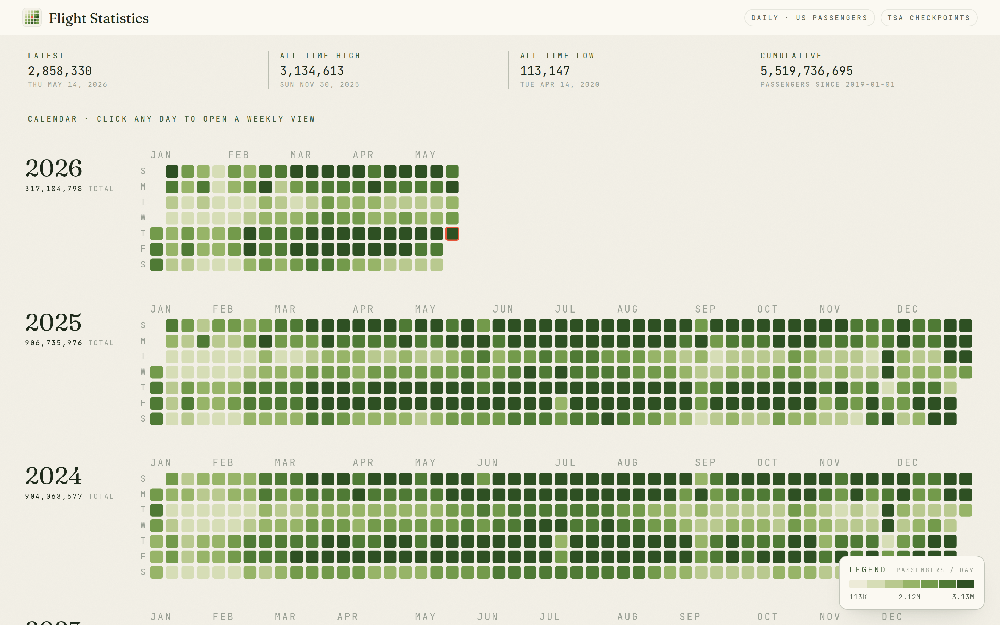
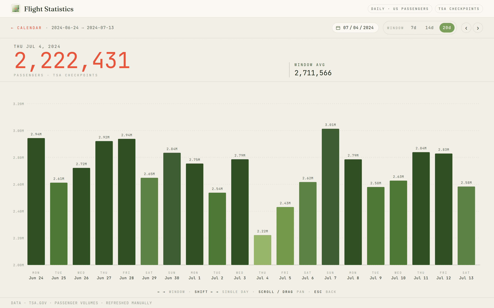
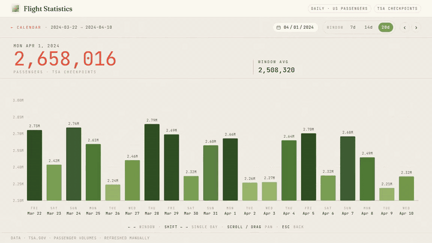

# Flight Statistics

A calendar heatmap + sliding weekly chart for TSA passenger volumes since 2019-01-01.

Built with SvelteKit + TypeScript. No charting library — every pixel is hand-drawn SVG so the aesthetic stays cohesive end to end.

## Screens

Calendar (`/`) — first viewport on a 1440×900 laptop:



Weekly view (`/week`):



Scrolling the weekly view (arrow keys + shift for single-day scrub, plain arrows for window-sized jumps; drag and horizontal-wheel work too):



## Run locally

```bash
npm install
npm run dev
# → http://127.0.0.1:5173
```

## Build

```bash
npm run build       # writes to ./build
npm run preview     # serves ./build at http://127.0.0.1:4173
```

Uses `@sveltejs/adapter-static` → ships as a plain static SPA. Drop the `build/` folder on any static host (Vercel, Netlify, Cloudflare Pages, GitHub Pages, S3 + CloudFront — all fine, no server runtime needed).

## Refresh data

```bash
# one-time, if not already installed:
npm i -D playwright-chromium
npx playwright install chromium

# then, any time you want fresh data:
node scripts/refresh.mjs
```

TSA is behind Akamai and blocks vanilla HTTP clients, so the refresh script drives a real headless Chromium. It walks `/travel/passenger-volumes/<year>` for 2019…last year and the unsuffixed page for the current year, then rewrites `tsa_passenger_volumes.csv`.

## Layout

- `tsa_passenger_volumes.csv` — canonical data (also symlinked into `static/` so the dev server serves it as-is)
- `src/lib/data.ts` — CSV → typed `Dataset`, sorted array + `Map<iso, Day>` index + quantile breakpoints
- `src/lib/colorScale.ts` — 7-bin sequential ramp (deep midnight → ember amber → cream); quantile-based so COVID's outliers don't crush the rest
- `src/lib/format.ts` — number + date formatters
- `src/lib/components/`
  - `CalendarHeatmap.svelte` — GitHub-style grid, one block per year, hover + keyboard nav
  - `WeeklyChart.svelte` — spaced bar chart with axes
  - `WindowSizeControl.svelte` — 7 / 14 / 20 day toggle
  - `Tooltip.svelte` — boarding-pass-styled hover card
  - `Legend.svelte` — fixed bottom-right gradient legend
- `src/routes/+page.svelte` — calendar (`/`)
- `src/routes/week/+page.svelte` — weekly view (`/week?date=…&size=…`)

## Keyboard

- `← →` — advance window by one window
- `shift ← →` — single day
- `Home` / `End` — first / latest day
- `Esc` — back to calendar